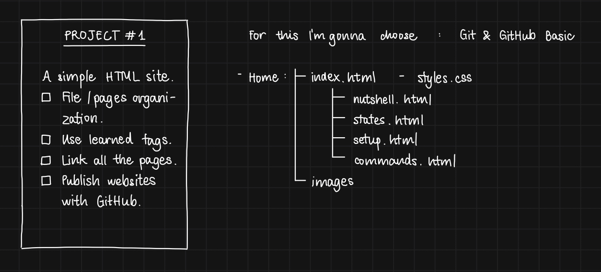

Hi,  
This is my first project for The Odin Project. The required project is "Odin Recipes" but I already did it in the past so I want to create something new this time.  

## What I've learnt  

- Organize my file system.
- How to use some basic HTML tags.
- Link pages (a tags).
- Link a local repository and a remote one (GitHub).
- Git has *master* as the default branch name while GitHub has *main*. So I configured my git default branch to be *main* globally.
- Publish a wedpage with GitHub Pages.
